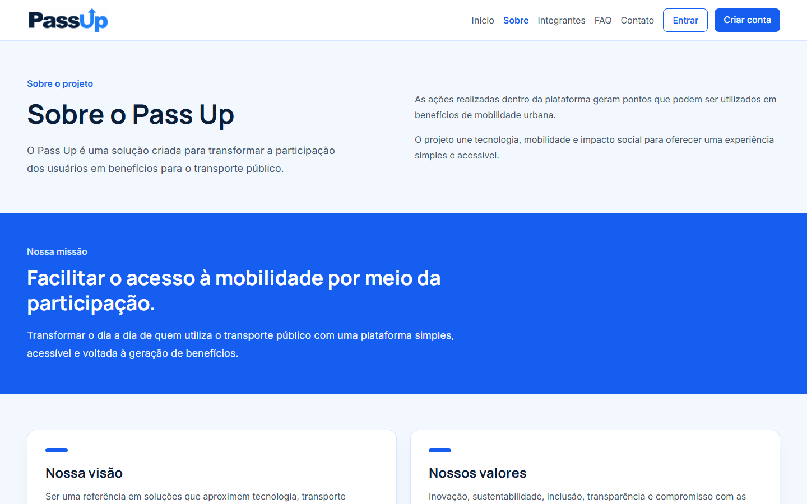
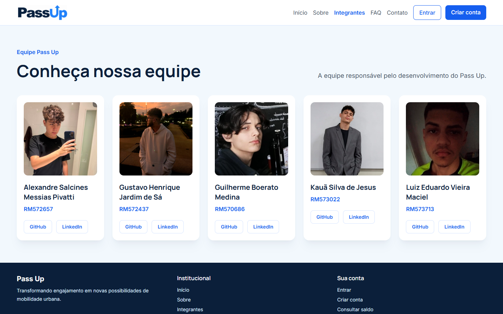
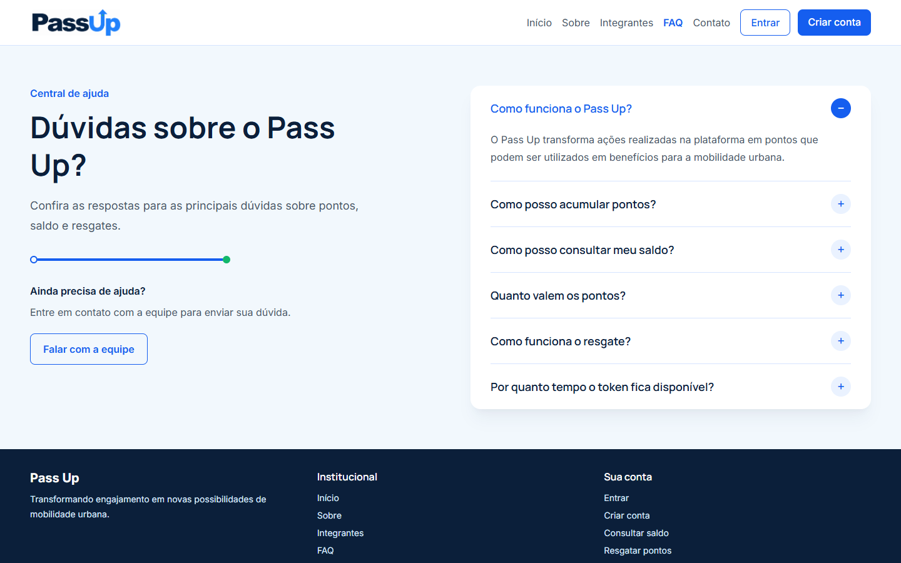
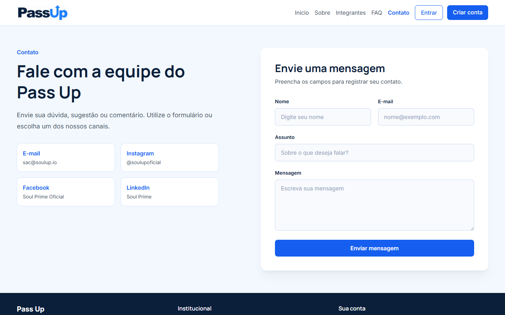
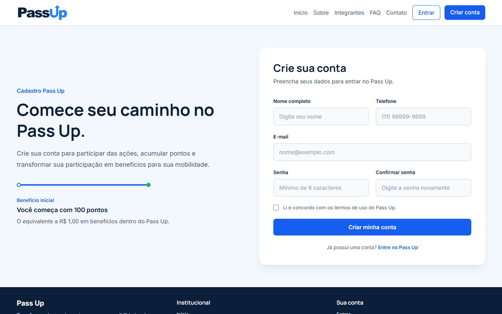
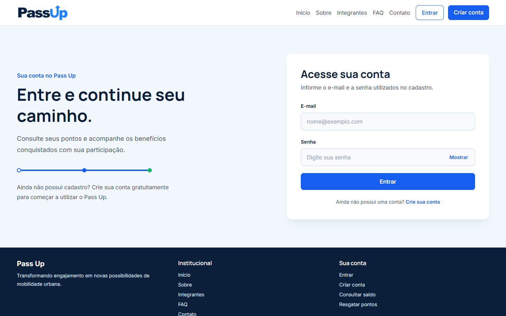
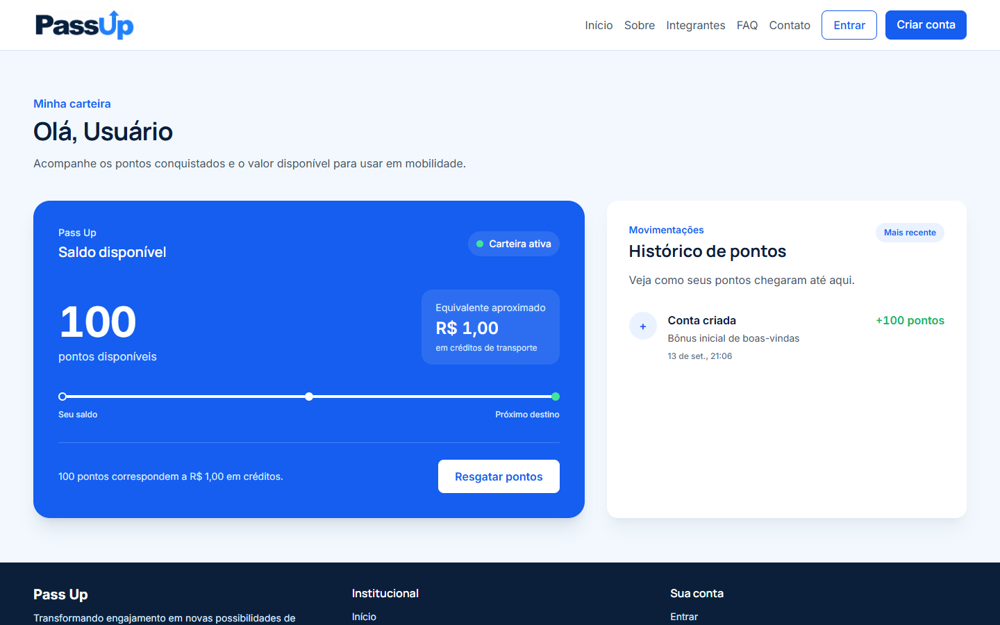
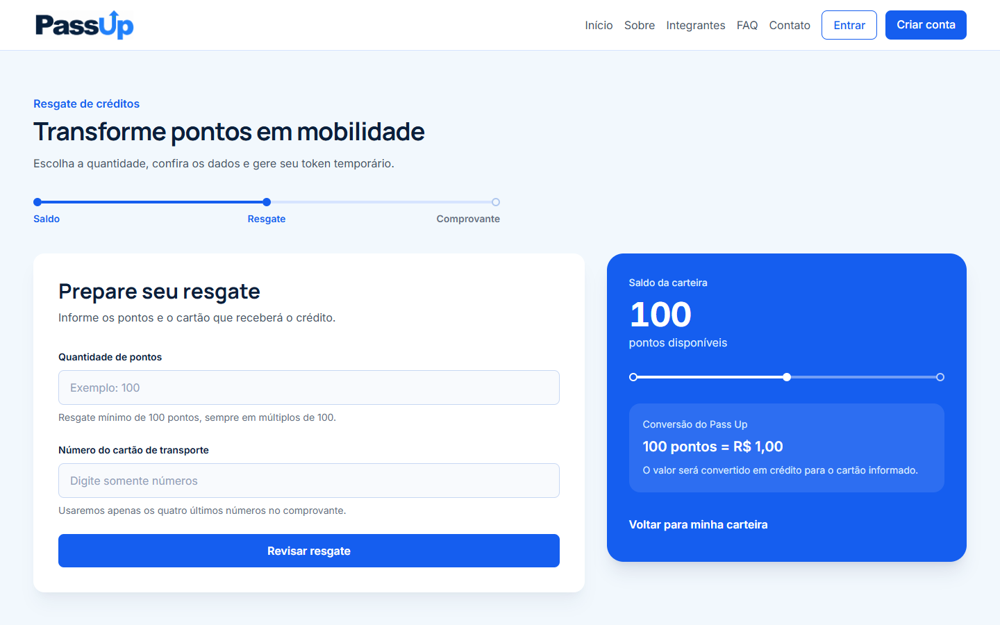
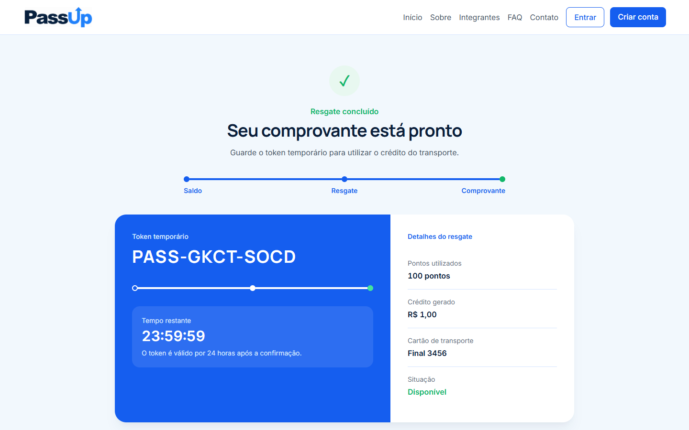
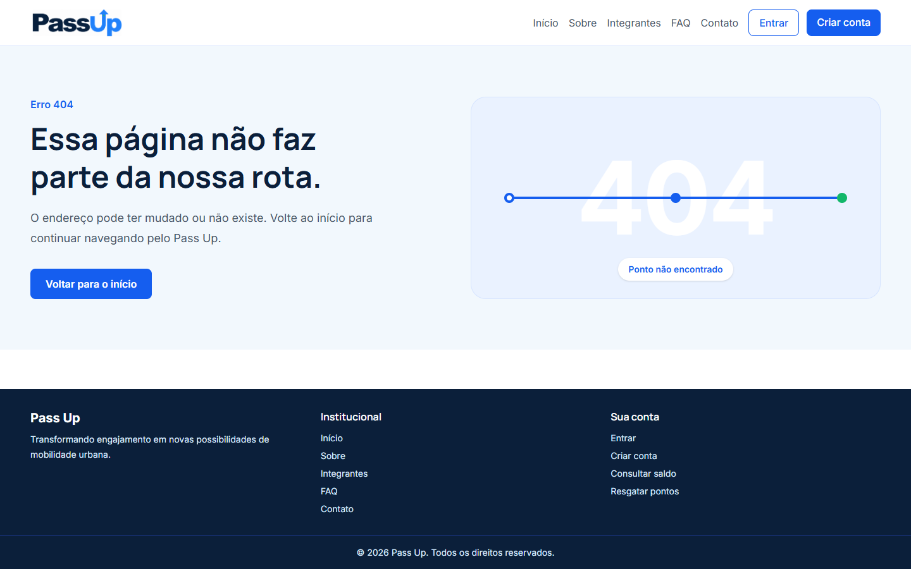

<p align="center">
  
</p>

<h1 align="center">Pass Up</h1>

<p align="center">
  <strong>Transformando participação em benefícios para a mobilidade urbana.</strong>
</p>

<p align="center">
  
  
  
  
</p>

<p align="center">
  Projeto desenvolvido para o Challenge FIAP 2026, em parceria com a Soul Up.
</p>

---

## 📋 Índice

- [Sobre o projeto](#-sobre-o-projeto)
- [Funcionalidades](#-funcionalidades)
- [Telas do sistema](#-telas-do-sistema)
- [Tecnologias](#-tecnologias)
- [Estrutura de pastas](#-estrutura-de-pastas)
- [Como executar](#-como-executar)
- [Como usar](#-como-usar)
- [Repositório e vídeo](#-repositório-e-vídeo)
- [Equipe](#-equipe)
- [Contato](#-contato)

---

## 💡 Sobre o projeto

O **Pass Up** é uma plataforma que transforma a participação dos usuários em pontos que podem ser utilizados como benefícios para o transporte público.

O projeto busca aproximar tecnologia, mobilidade urbana e impacto social por meio de uma experiência simples e acessível. Nesta Sprint, a solução do primeiro semestre foi reformulada como uma aplicação React com navegação em SPA, componentes reutilizáveis, formulários validados e layout responsivo.

| Objetivo | Descrição |
|:---|:---|
| **Missão** | Facilitar o acesso à mobilidade por meio da participação. |
| **Visão** | Ser uma referência em soluções que aproximem tecnologia, transporte e impacto social. |
| **Valores** | Inovação, sustentabilidade, inclusão, transparência e compromisso com os usuários. |

---

## ⚙️ Funcionalidades

- [x] Apresentação do Pass Up e de sua proposta
- [x] Cadastro e login simulados
- [x] Saldo inicial e conversão de pontos em créditos
- [x] Histórico de movimentações da carteira
- [x] Resgate de pontos para cartão de transporte
- [x] Geração de token temporário válido por 24 horas
- [x] Rota dinâmica para exibição do comprovante de resgate
- [x] FAQ expansível
- [x] Formulário de contato com validação e mensagem de confirmação
- [x] Página da equipe com GitHub e LinkedIn dos integrantes
- [x] Página personalizada para endereços não encontrados
- [x] Layout responsivo para celular, tablet e desktop

> A aplicação é uma simulação acadêmica e não realiza operações financeiras nem consome APIs externas.

---

## 🖥️ Telas do sistema

### Home

Página inicial com a apresentação do Pass Up e acesso aos principais fluxos da plataforma.


<details open>
  <summary><strong>Ver as outras telas do projeto</strong></summary>
  <br>

  <table>
    <tr>
      <td align="center" width="50%">
        <strong>Sobre</strong><br><br>
        
      </td>
      <td align="center" width="50%">
        <strong>Integrantes</strong><br><br>
        
      </td>
    </tr>
    <tr>
      <td align="center">
        <strong>FAQ</strong><br><br>
        
      </td>
      <td align="center">
        <strong>Contato</strong><br><br>
        
      </td>
    </tr>
    <tr>
      <td align="center">
        <strong>Cadastro</strong><br><br>
        
      </td>
      <td align="center">
        <strong>Login</strong><br><br>
        
      </td>
    </tr>
    <tr>
      <td align="center">
        <strong>Saldo</strong><br><br>
        
      </td>
      <td align="center">
        <strong>Resgate</strong><br><br>
        
      </td>
    </tr>
    <tr>
      <td align="center">
        <strong>Comprovante</strong><br><br>
        
      </td>
      <td align="center">
        <strong>Página 404</strong><br><br>
        
      </td>
    </tr>
  </table>
</details>

---

## 🛠️ Tecnologias

| Tecnologia | Utilização no projeto |
|:---|:---|
| **React** | Construção das páginas e dos componentes reutilizáveis |
| **TypeScript** | Tipagem de dados, formulários, propriedades e contexto da aplicação |
| **Vite** | Criação, execução e build do projeto |
| **Tailwind CSS** | Estilização e responsividade da interface |
| **React Router DOM** | Navegação SPA, rotas estáticas e rota dinâmica de resgate |
| **React Hook Form** | Controle, tipagem e validação dos formulários |
| **Inter e Manrope** | Tipografia utilizada na interface |

---

## 📁 Estrutura de pastas

```text
passup/
├── public/
│   └── images/
│       ├── integrantes/
│       └── readme/
├── src/
│   ├── components/
│   │   ├── Cabecalho/
│   │   ├── CardIntegrante/
│   │   ├── CardValor/
│   │   ├── ItemFaq/
│   │   ├── ItemHistorico/
│   │   └── Rodape/
│   ├── data/
│   ├── pages/
│   │   ├── Cadastro/
│   │   ├── Contato/
│   │   ├── DetalheResgate/
│   │   ├── Faq/
│   │   ├── Home/
│   │   ├── Integrantes/
│   │   ├── Login/
│   │   ├── PaginaNaoEncontrada/
│   │   ├── Resgate/
│   │   ├── Saldo/
│   │   └── Sobre/
│   ├── routes/
│   ├── types/
│   ├── App.tsx
│   ├── global.css
│   └── main.tsx
├── index.html
├── package.json
├── package-lock.json
├── tsconfig.json
└── vite.config.ts
```

- `components`: elementos reutilizados em diferentes partes da aplicação.
- `data`: dados locais utilizados pelas páginas.
- `pages`: páginas acessadas pelas rotas do projeto.
- `routes`: configuração central das rotas.
- `types`: interfaces e tipos compartilhados.

---

## 🚀 Como executar

### Pré-requisitos

- [Node.js](https://nodejs.org/) em versão LTS
- [Git](https://git-scm.com/)

### Instalação

```bash
# Clone o repositório
git clone https://github.com/pivattidev/passup.git

# Entre na pasta do projeto
cd passup

# Instale as dependências
npm install

# Inicie o servidor de desenvolvimento
npm run dev
```

Abra no navegador o endereço apresentado pelo Vite, normalmente:

```text
http://localhost:5173
```

Para verificar a versão de produção:

```bash
npm run build
npm run preview
```

---

## 🧭 Como usar

1. Acesse a página **Criar conta** e preencha os dados solicitados.
2. Entre na plataforma usando o mesmo e-mail e senha do cadastro.
3. Consulte os 100 pontos iniciais na página **Saldo**.
4. Escolha **Resgatar pontos** e informe a quantidade e o cartão de transporte.
5. Revise os dados e confirme o resgate.
6. Consulte o comprovante e o token temporário gerado pela aplicação.

Como esta versão não utiliza API nem banco de dados, os dados simulados permanecem apenas enquanto a aplicação estiver aberta.

---

## 🔗 Repositório e vídeo

- **Repositório:** [github.com/pivattidev/passup](https://github.com/pivattidev/passup)
- **Vídeo de apresentação no YouTube:** adicionar o link após a publicação do vídeo

---

## 👥 Equipe

Projeto desenvolvido por estudantes do curso de **Análise e Desenvolvimento de Sistemas**, turma **1TDSPF**, da FIAP.

| Foto | Integrante | RM e turma | GitHub | LinkedIn |
|:---:|:---|:---:|:---:|:---:|
|  | **Alexandre Salcines Messias Pivatti** | RM572657<br>1TDSPF | [GitHub](https://github.com/pivattidev) | [LinkedIn](https://www.linkedin.com/in/alexandre-pivatti-7b1a9a3a4/) |
|  | **Gustavo Henrique Jardim de Sá** | RM572437<br>1TDSPF | [GitHub](https://github.com/GustavoJardimSa) | [LinkedIn](https://www.linkedin.com/in/gustavo-de-sa-3113473b8/) |
|  | **Guilherme Boerato Medina** | RM570686<br>1TDSPF | [GitHub](https://github.com/guilhermemedina22) | [LinkedIn](https://www.linkedin.com/in/guilherme-medina-025b4437b/) |
|  | **Kauã Silva de Jesus** | RM573022<br>1TDSPF | [GitHub](https://github.com/kauansilva1472) | [LinkedIn](https://www.linkedin.com/in/kau%C3%A3-silva-9147a0351/) |
|  | **Luiz Eduardo Vieira Maciel** | RM573713<br>1TDSPF | [GitHub](https://github.com/LuizVMaciel) | [LinkedIn](https://www.linkedin.com/in/luiz-eduardo-vieira-maciel-038704356/) |

---

## 📬 Contato

- **E-mail:** [sac@soulup.io](mailto:sac@soulup.io)
- **GitHub:** os integrantes podem ser encontrados pelos perfis indicados na seção da equipe.
- **Aplicação:** a página de contato permite registrar dúvidas, sugestões e comentários de forma simulada.

---

<p align="center">
  Desenvolvido pela equipe Pass Up | FIAP 2026
</p>
